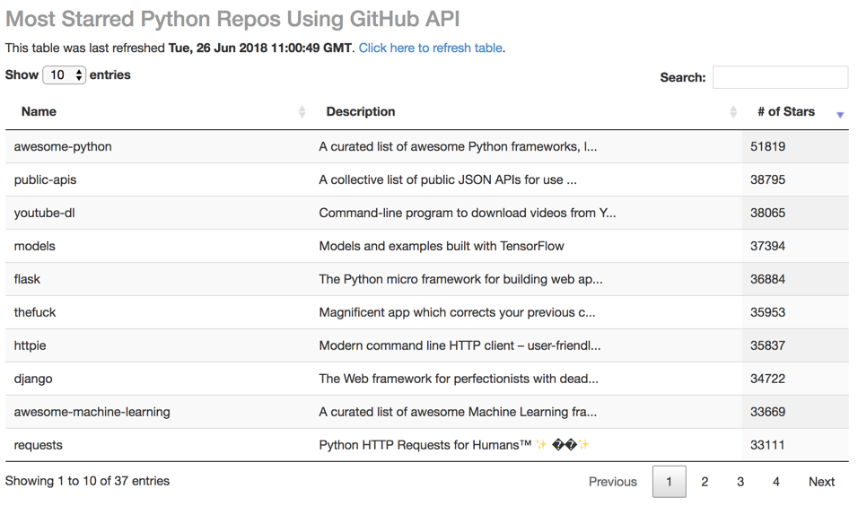
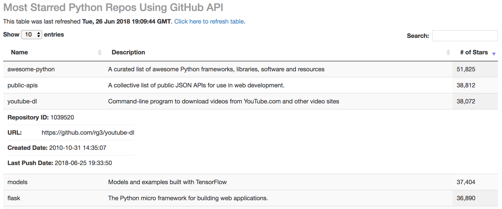

## Most Starred Python Repos Using GitHub API

This code serves a web app that runs locally. The web app displays the most starred Python repos on GitHub:

More details about a repo are displayed when the row is clicked:

#### Requirements
+ MySql 5.7.22
+ Python 2.7
  + requests, sqlalchemy, pymysql, flask, datetime, json, re, pandas

#### Files
**get_most_starred.py** 
Run this script to refresh the local database of most starred GitHub repos

**app.py** 
Run this script to run the web app locally (requires local MySQL database setup). Go to [0.0.0.0:8080](0.0.0.0L8080) in your browser to view the app.

Contains functions for rendering a DataTable of the `starred` table in `victr` database.

**templates/index.html** 
This is the main template for the web app. Database / table refreshes can be executed within this template.

**creds.json** *(not included in public repo)* 
This json file should contain your own username/password for running MySQL on your local machine.

#### `starred` Table Schema in `victr` Database

|Column|Type|Other|
|:-:|:-:|:--|
|repository_ID|BIGINT(20)|PRIMARY KEY NOT NULL|
|name|TEXT|NOT NULL|
|URL|TEXT|NOT NULL|
|created_date|DATETIME|NOT NULL|
|last_push_date|DATETIME|NOT NULL|
|description|TEXT| |
|number_of_stars|BIGINT(20)|NOT NULL|
|table_entry_dt|DATETIME|NOT NULL|
